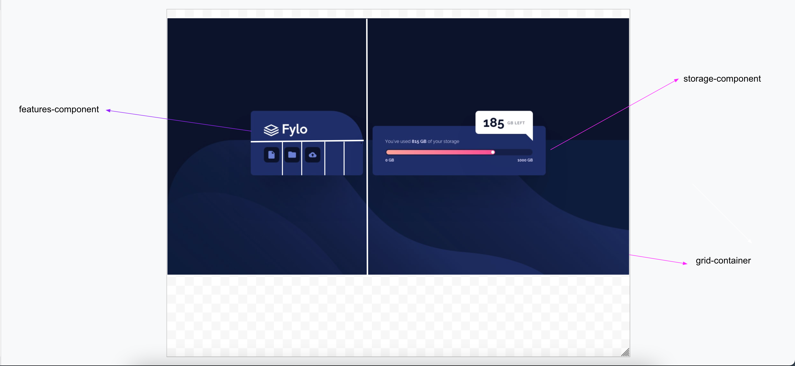

# Frontend Mentor - Fylo data storage component solution

This is a solution to the [Fylo data storage component challenge on Frontend Mentor](https://www.frontendmentor.io/challenges/fylo-data-storage-component-1dZPRbV5n). Frontend Mentor challenges help you improve your coding skills by building realistic projects.

## Table of contents

- [Overview](#overview)
  - [The challenge](#the-challenge)
  - [Screenshot](#screenshot)
  - [Links](#links)
- [My process](#my-process)
  - [Built with](#built-with)
  - [What I learned](#what-i-learned)
  - [Continued development](#continued-development)
  - [Useful resources](#useful-resources)
- [Author](#author)
- [Acknowledgments](#acknowledgments)

## Overview

This is 12th project from "Frontend Mentor" to sharpen HTML & CSS skills along with responsive web design and it's build with "BEM", "Grid & Flexbox layout".

### The challenge

Users should be able to:

- View the optimal layout for the site depending on their device's screen size

### Screenshot

### Links

- [Live Site URL](https://vikramvi.github.io/Fylo-data-storage-component/)

## My process

### Built with

- Semantic & Accessible HTML5 markup
- CSS BEM
- CSS Grid
- CSS Flexbox
- Mobile-first workflow
- FF & Chrome Dev Tools

### What I learned

- Limits of my CSS knowledge, how much more do I need to learn ?
- positioning, spacing techniques in grid and flexbox layouts
- quite a few new CSS tricks

### Continued development

- revision of CSS basic concepts
- cementing basic concepts to avoid trial and error

### Useful resources

- Frontend Mentor slack community + website
- YT videos
- Google ofcourse
- Stackoverflow
- Twitter dev community

## Author

- Frontend Mentor - [@vikramvi](https://www.frontendmentor.io/profile/vikramvi)

## Acknowledgments

- FM community
- YT content creators
- Google + SO community
